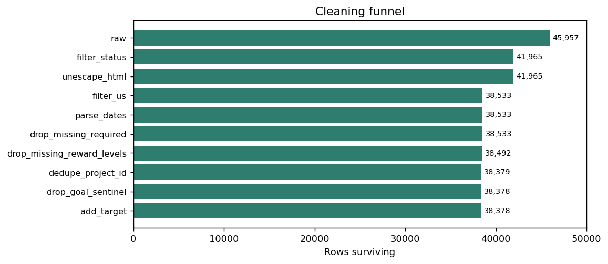
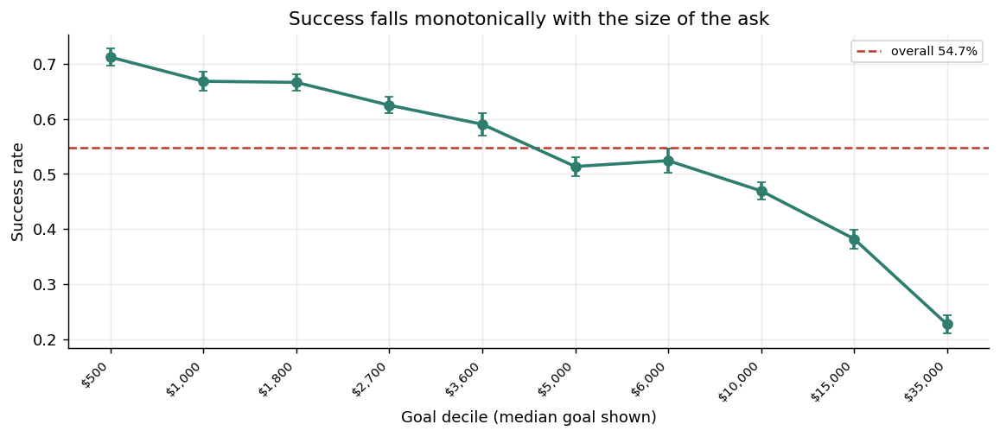
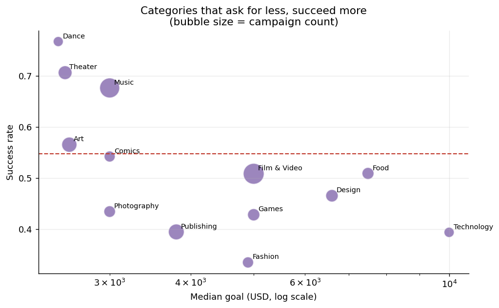
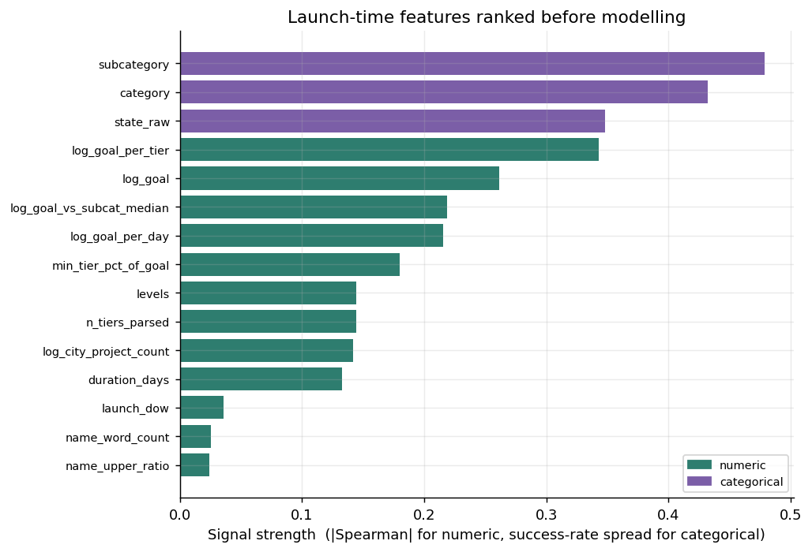
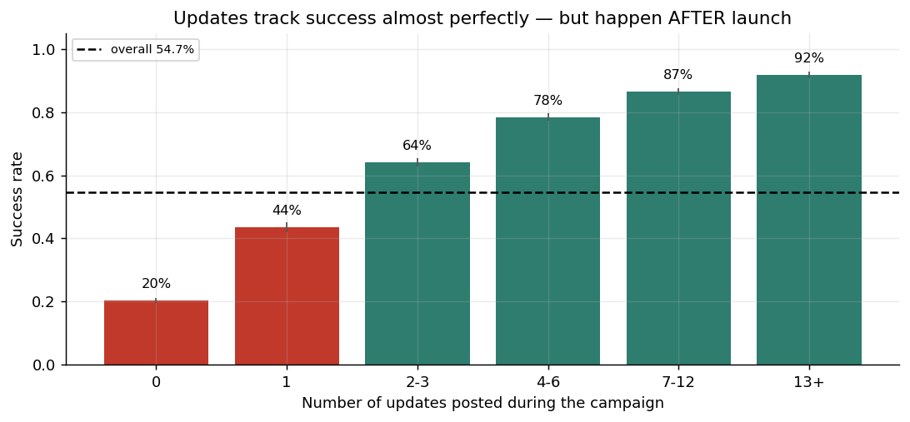

# Kickstarter Crowdfunding Recommendation Engine

Predicting whether a Kickstarter campaign will succeed or fail from
information available **at launch**, and turning the drivers of success into
actionable advice for creators.

Break Through Tech AI Studio — Fall 2026
Challenge Advisor: Neha Panchal · AI Studio Coach: Darshan Ugale

> **Status:** September milestone complete — data preparation and exploratory
> data analysis (Tasks 1–5). Machine learning begins in October.

---

## Team Members

| Name             | GitHub Handle | Contribution                                                             |
|------------------|---------------|--------------------------------------------------------------------------|
| James Lu         | @jameslu06    | Data exploration, visualization, overall project coordination            |
| Yero Barry       | @Ybarry2      | Python development, AI/ML, prompt engineering, and team communication    |
| Faaliha Mohamed  | @yourhandle   | Data analysis, web development, documentation, and team collaboration    |
| Menwe Okafor     | @yourhandle   | Python development, AI model development, and data analysis              |

---

## September Milestone — Tasks

| # | Task | Target | Status | Evidence |
|---|------|--------|--------|----------|
| 1 | Download and inspect the dataset | 9/9 | Done | `notebooks/01_inspection.ipynb` |
| 2 | Filter and clean the dataset | 9/13 | Done | `notebooks/02_cleaning.ipynb` |
| 3 | Prepare features for analysis | 9/17 | Done | `notebooks/03_features.ipynb` |
| 4 | Perform exploratory data analysis | 9/24 | Done | `notebooks/04_eda.ipynb` |
| 5 | Create visualizations and summarize findings | 9/30 | Done | `notebooks/04_eda.ipynb`, `reports/` |

---

## Project Highlights

- Built a reproducible preprocessing pipeline reducing the raw 45,957-row
  scrape to a **38,378-row** modelling table, with every transformation
  logged and row-counted.
- Found and fixed an **HTML-entity encoding bug** that silently split the
  platform's largest category (`Film &amp; Video` vs `Film & Video`) into
  two, and the same class of bug in the location column (`MT` vs `Mt`).
- **Validated against the original project's recipe** to within one row
  (38,492 vs their published 38,491) before making any deliberate change.
- Identified a **data leakage risk** in the `updates` variable that will
  shape the modelling approach in October.

---

## Setup and Installation

```bash
git clone https://github.com/<your-org>/State-Street-1B-kickstarter-crowdfunding-recommendation-engine.git
cd State-Street-1B-kickstarter-crowdfunding-recommendation-engine

python -m venv .venv
source .venv/bin/activate        # Windows: .venv\Scripts\activate
pip install -r requirements.txt

jupyter lab
```

The raw dataset zip is committed to `data/`, so no Kaggle login is needed.
Run the notebooks **in order** — 02 writes the parquet file 03 reads, and 03
writes the splits 04 reads.

### Repository layout

```
src/loading.py      Raw load: encoding handling, column normalisation
src/cleaning.py     Filter, clean and validate, with an auditable step log
src/features.py     Feature engineering and leakage register
notebooks/          One notebook per task
data/               Raw zip (committed) + derived parquet (gitignored)
reports/            Step log, EDA tables, summary statistics
reports/figures/    Generated charts
```

Cleaning and feature logic lives in `src/`, not in the notebooks, so there is
exactly one definition of "the modelling table" imported by three notebooks
rather than three that can quietly drift apart.

---

## Project Overview

Crowdfunding is unforgiving: Kickstarter is all-or-nothing, so a campaign
raising 99% of its goal returns every dollar and the creator gets nothing.
**Roughly 45% of resolved campaigns in this dataset failed.** A creator has
to make several irreversible decisions — how much to ask for, how long to
run, how to structure rewards — before any feedback exists.

That sets the requirement: the model has to work from information available
**at launch**, or it cannot inform those decisions.

---

## Data Exploration

**Source:** [Kickstarter dataset on Kaggle](https://www.kaggle.com/parienza/kickstarter)
**Raw size:** 45,957 campaigns × 17 columns
**Coverage:** April 2009 – May 2012
**Final table:** 38,378 campaigns × 56 features — 13 categories,
49 subcategories, 51 states, 3,153 cities

### Data quality issues found

| # | Issue | Resolution |
|---|---|---|
| 1 | File is neither UTF-8 nor cp1252 (bytes `0x92`, `0x8f`) | Load with `encoding="latin-1"` |
| 2 | `Film &amp; Video` and `Film & Video` are separate categories | `html.unescape()` **before** grouping — 14 to 13 categories, 51 to 49 subcategories |
| 3 | Montana appears as both `MT` and `Mt` | Case-insensitive state whitelist |
| 4 | 142 duplicated `project_id` values | Deduplicate on the platform's own primary key |
| 5 | Max goal is $21,474,836.47 = 2³¹−1 cents | Integer overflow artefact; row dropped |
| 6 | `funded_date` is the campaign **end** date | Recovered `launch_date = funded_date − duration` |
| 7 | `reward_levels` has commas *inside* amounts (`$1,000`) | Comma-aware regex; **100%** agreement with the scraper's own `levels` column |
| 8 | Nulls in `location`, `reward_levels`, `pledged` | `dropna` on modelling columns only |

### Cleaning funnel



45,957 to 38,378 rows. Full audit trail in `reports/cleaning_step_log.csv`.

### Validation

- **Benchmark recipe reproduced.** Applying the original project's filters
  yields 38,492 rows against their stated 38,491 — a single row apart.
  Confirming this *before* deviating means our changes are distinguishable
  from our mistakes.
- **Labels are trustworthy.** `status` and `funded_percentage` agree on
  99.98% of rows; only 3 contradict, all scrape-timing artefacts.
- **Three documented deviations** cost 114 rows (0.30%). The important one is
  deduplication — the original kept 113 duplicate scrapes, which would place
  the same campaign in both train and test.

### EDA findings

Class balance is 54.7% successful, so **any model must beat 54.7% accuracy**
to be doing better than always guessing "successful."

| Rank | Factor | Effect on success | Known at launch? |
|---|---|---|---|
| 1 | **Updates** | 20% to 92% from 0 to 13+ updates | **No** |
| 2 | **Goal** | Monotonic decline across all 10 deciles | Yes |
| 3 | **Subcategory** | Widest categorical spread, 29% to 77% | Yes |
| 4 | **Reward tiers** | More tiers and a low entry price both help | Yes |
| 5 | **Duration** | Longer is *worse*; the 30-day default wins | Yes |
| 6 | **Category** | Real effect, survives controlling for goal | Yes |
| 7 | **Location** | Modest — a few points between best/worst states | Yes |

**Median values by outcome:**

| | Successful | Failed |
|---|---|---|
| Goal | $3,000 | $5,000 |
| Duration | 31.0 days | 35.0 days |
| Reward tiers | 8 | 7 |
| Updates | 5 | 0 |



**Goal is the strongest launch-time signal**, and the shape matters as much
as the direction: the decline is steep below ~$20k and flattens above it,
which is what makes goal-setting advice actionable.



**We controlled for the obvious confound.** Dance and Theater post excellent
success rates — but they also ask for far less money (Spearman −0.68 between
a category's median goal and its success rate). Comparing categories *within*
goal quartiles shows the ordering largely survives, so both effects are real
and neither explains the other away.

**Duration runs against intuition:** longer campaigns do *worse*. A long
window signals low confidence; momentum matters more than time.



Features are ranked **before** any model is fitted — rank correlation for
numeric features, success-rate spread for categorical ones — so the ranking
reflects the data rather than one algorithm's inductive bias.

### The leakage risk to resolve before modelling



`updates` counts creator posts made *during* a campaign, and it is the
strongest signal in the dataset — 20% success at zero updates, 92% at
thirteen or more.

It cannot be used in a launch-time model. It is zero on launch day for every
campaign, and the causation runs at least partly backwards: a campaign
visibly funding well attracts a creator who keeps posting, while a stalling
one goes quiet.

**The published benchmark for this dataset (80.2% accuracy, F1 0.834) was
produced with `updates` included.** Whether to match that number or exclude
the variable is the first decision of Milestone 3, and it should be settled
with the Challenge Advisor before any model is trained.

### Assumptions and caveats

1. The current split is random and stratified. Since `launch_date` was
   recovered, October should also report a **chronological** split, which
   matches the deployment scenario.
2. Goal-derived and reward-tier features are collinear. Trees will cope;
   Logistic Regression will need regularisation.
3. The data spans 2009–2012, including Kickstarter's June 2011 change
   capping campaigns at 60 days. `launch_year` partly absorbs this drift,
   but the model should not be assumed valid for present-day Kickstarter.

---

## Next Steps — October (Milestone 3)

1. **Settle the `updates` question** and lock a leakage register before
   training anything.
2. Build Logistic Regression, Random Forest and KNN, measured against the
   54.7% majority-class floor.
3. Compare on Accuracy, Precision, Recall, F1 and ROC-AUC.
4. Feature selection, hyperparameter tuning, and interpretability via
   permutation importance or SHAP.

Closing the gap on a launch-time model likely requires signal this scrape
does not contain: campaign description text, video presence, image count,
creator history, and social following.

---

## License

This project is licensed under the MIT License.

---

## References

- [Kickstarter dataset on Kaggle](https://www.kaggle.com/parienza/kickstarter)
- [scikit-learn documentation](https://scikit-learn.org/stable/)

---

## Acknowledgements

Thanks to Challenge Advisor Neha Panchal and AI Studio Coach Darshan Ugale
for guidance throughout this project.
